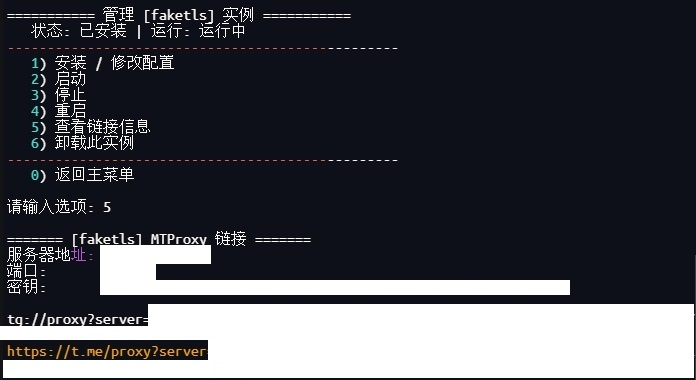

## **MTProxy 多实例管理脚本**

## **✨ 功能特性**
- **多实例共存：可以同时安装和管理 `secured` 和 `faketls` 两种模式的代理，互不干扰。**
- **轻量高效：资源占用极低，适合小内存机器使用。**
- **强大的系统兼容性: 完美支持 Debian、Alpine （开机自启动），其他系统暂无测试。同时兼容Docker虚拟化的Debian、Alpine（因为是使用direct，所以重启后需要手动启动MTP服务）**

## **脚本界面**




### **使用以下命令运行脚本**

**快捷命令：mtp**

```
(curl -LfsS https://raw.githubusercontent.com/0xdabiaoge/MTProxy/main/MTP.sh -o /usr/local/bin/mtp || wget -q https://raw.githubusercontent.com/0xdabiaoge/MTProxy/main/MTP.sh -O /usr/local/bin/mtp) && chmod +x /usr/local/bin/mtp && mtp
```
## **免责声明**
- **本项目仅供学习与技术交流，请在下载后 24 小时内删除，禁止用于商业或非法目的。**
- **使用本脚本所搭建的服务，请严格遵守部署服务器所在地、服务提供商和用户所在国家/地区的相关法律法规。**
- **对于任何因不当使用本脚本而导致的法律纠纷或后果，脚本作者及维护者概不负责。**
